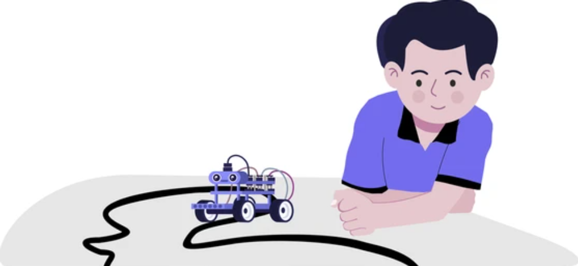

+++
date = '2026-04-06'
draft = false
title = 'A Beginners Guide to Robotics'
tags = ["Robotics","Electronics","Blog"] 
[cover]
    image= "Cover.png"
    alt= "Coverimage"
    relative= false
+++

## A Beginners Guide to Robotics.
We've all seen those flashy robots working smoothly and carrying out tasks just like a human and we've often thought if we can build such robots ourselves. While it can seem like a steep learning curve however if one starts at the right place, it'll surely be a smooth path. One such robot that is often recommended for beginners is a Line Following Robot. 
The Line Following Robot is a completely autonomous bot that guides itself through a track using certain sensors. Now, we can explain this robot by using the human body as an analogy.  
Firstly, the 'eyes' of our robot is a very crucial thing, they are what lets the robot see the track. Consider a black track on a white background, the eyes of our robot are essentially an IR sensor. It works by shooting off a beam of light, if that light reaches back to the IR sensor, it knows it's on a white background whereas if the light is not reflected back, the robot knows that it has stumbled upon a black surface.  
Next, this input is fed into the 'brain' of the robot, which is a microcontroller. The microcontroller is very much similar to a human brain as it gives out the instruction for the bot about the next action. Microcontrollers available in the market such as Arduino, ESP32, or even Rasberry Pi can be chosen depending upon the complexity and needs of the circuit. For a beginner level bot, Arduino will suffice. The microcontroller has certain code uploaded into it. This is the algorithm that decides the movement of the bot. Mainly two types of algorithm is used for Line following robots, a Bang-Bang Algorithm and a PID controlled Algorithm, the latter being more sophisticated than the former.  
When the microcontroller decides what the next step is, it transmits that signal to a Motor Driver module usually L298N or TB6612FNG. The Motor driver is analogous to the muscles of human body. It decides the next movement based on the input received from the microcontroller or the 'brain'. The 'legs' of our robot are the geared motors which have wheels attached to them and they move as per the signal received from motor driver.  
**Connect these components properly and in the end you'll have an intelligent, self guiding robot paving your path to the exciting world of Robotics!** 

